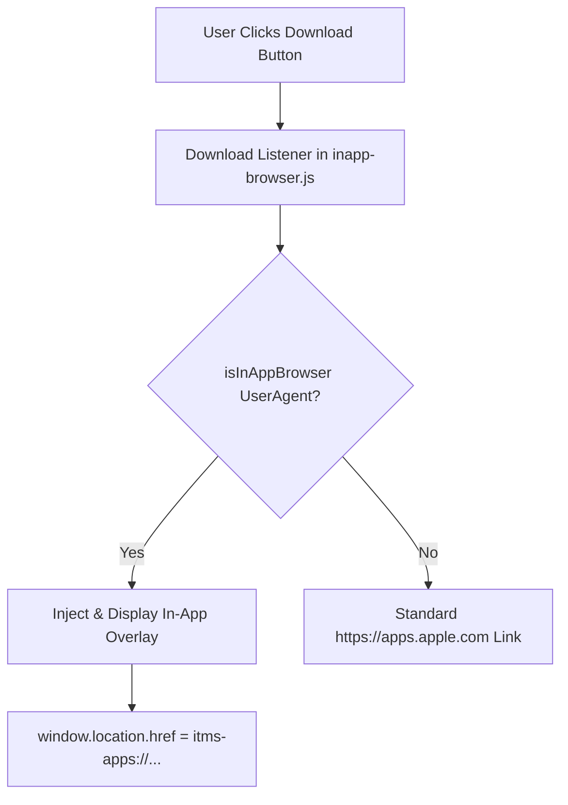

# In-App Browser Download Prompt Implementation Plan

> **For agentic workers:** REQUIRED SUB-SKILL: Use superpowers:subagent-driven-development to implement this plan task-by-task. Steps use checkbox (`- [ ]`) syntax for tracking.

**Goal:** Intercept App Store download button clicks in in-app webviews (Instagram, WeChat, TikTok, Facebook, Line, Twitter/X), displaying an Apple-native full-screen prompt overlay guiding users to open in Safari/default browser while attempting an `itms-apps://` scheme redirect.

**Architecture:** 
1. Define i18n translation keys in [translations.js](file:///Volumes/SN5100/Users/waittim/Documents/Code/markd-site/assets/js/translations.js).
2. Add full-screen frosted glass overlay CSS styles and pointing arrow in [style.css](file:///Volumes/SN5100/Users/waittim/Documents/Code/markd-site/assets/css/style.css).
3. Create `assets/js/components/inapp-browser.js` providing `window.MarkdInAppBrowser` with UA detection, modal control, and click listener binding.
4. Add `assets/js/components/inapp-browser.js` to [build-js.sh](file:///Volumes/SN5100/Users/waittim/Documents/Code/markd-site/scripts/build-js.sh) and initialize it in [main.js](file:///Volumes/SN5100/Users/waittim/Documents/Code/markd-site/assets/js/main.js), then compile [markd.bundle.js](file:///Volumes/SN5100/Users/waittim/Documents/Code/markd-site/assets/js/markd.bundle.js).

**Architecture Diagram:**



**Tech Stack:** Vanilla JavaScript (ES6+), Vanilla CSS (Custom Properties, Glassmorphism, Backdrop Filter), HTML5.

## Global Constraints
- Apple-native aesthetics: Dark/light frosted glass background, system SF Pro fonts, pill buttons.
- Multi-language support: `en`, `zh`, `zh-TW`.
- Zero third-party runtime dependencies.

---

### Task 1: Add i18n Translations and CSS Overlay Styles

**Files:**
- Modify: [assets/js/translations.js](file:///Volumes/SN5100/Users/waittim/Documents/Code/markd-site/assets/js/translations.js)
- Modify: [assets/css/style.css](file:///Volumes/SN5100/Users/waittim/Documents/Code/markd-site/assets/css/style.css)

**Interfaces:**
- Consumes: `translations.js` schema (`en`, `zh`, `zh-TW`).
- Produces: CSS class `.inapp-overlay`, `.inapp-card`, `.inapp-arrow`, and translation keys `inapp_title`, `inapp_subtitle`, `inapp_step1`, `inapp_step2`, `inapp_dismiss`.

- [ ] **Step 1: Add translation keys to `assets/js/translations.js`**

Add `inapp_*` strings to `en`, `zh`, and `zh-TW` translation dictionary objects.

```diff
     en: {
+        inapp_title: "Open in Safari",
+        inapp_subtitle: "In-app browsers restrict direct App Store access.",
+        inapp_step1: "1. Tap top-right menu (•••)",
+        inapp_step2: "2. Select 'Open in Safari' or Default Browser",
+        inapp_dismiss: "Got it",
     },
     zh: {
+        inapp_title: "在 Safari 中打开",
+        inapp_subtitle: "当前内置浏览器无法直接跳转 App Store",
+        inapp_step1: "1. 点击右上角「•••」菜单",
+        inapp_step2: "2. 选择「在 Safari 或默认浏览器中打开」",
+        inapp_dismiss: "我知道了",
     },
     'zh-TW': {
+        inapp_title: "在 Safari 中開啟",
+        inapp_subtitle: "當前內建瀏覽器無法直接跳轉 App Store",
+        inapp_step1: "1. 點擊右上角「•••」選單",
+        inapp_step2: "2. 選擇「在 Safari 或預設瀏覽器中開啟」",
+        inapp_dismiss: "我知道了",
     }
```

- [ ] **Step 2: Add CSS rules for `.inapp-overlay` in `assets/css/style.css`**

Add overlay styles at the bottom of `assets/css/style.css`.

```css
/* ============================================
   In-App Browser Download Prompt Overlay
   ============================================ */
.inapp-overlay {
    position: fixed;
    inset: 0;
    z-index: 99999;
    background: rgba(0, 0, 0, 0.78);
    backdrop-filter: blur(20px);
    -webkit-backdrop-filter: blur(20px);
    display: flex;
    align-items: center;
    justify-content: center;
    padding: 24px;
    opacity: 0;
    visibility: hidden;
    transition: opacity 0.25s ease, visibility 0.25s ease;
}

.inapp-overlay.is-visible {
    opacity: 1;
    visibility: visible;
}

.inapp-arrow-container {
    position: absolute;
    top: 12px;
    right: 20px;
    display: flex;
    flex-direction: column;
    align-items: flex-end;
    color: #FFFFFF;
    pointer-events: none;
    animation: bounce-arrow 1.5s infinite ease-in-out;
}

.inapp-arrow-svg {
    width: 64px;
    height: 64px;
    filter: drop-shadow(0 2px 8px rgba(0,0,0,0.5));
}

@keyframes bounce-arrow {
    0%, 100% { transform: translateY(0) translateX(0); }
    50% { transform: translateY(-6px) translateX(4px); }
}

.inapp-card {
    background: rgba(26, 26, 30, 0.88);
    border: 1px solid rgba(255, 255, 255, 0.12);
    box-shadow: 0 20px 40px rgba(0, 0, 0, 0.5), inset 0 1px 0 rgba(255, 255, 255, 0.1);
    border-radius: 24px;
    padding: 28px 24px;
    max-width: 340px;
    width: 100%;
    text-align: center;
    color: #F5F5F7;
    transform: scale(0.92);
    transition: transform 0.25s cubic-bezier(0.16, 1, 0.3, 1);
}

.inapp-overlay.is-visible .inapp-card {
    transform: scale(1);
}

.inapp-title {
    font-size: 20px;
    font-weight: 700;
    margin-bottom: 8px;
    color: #FFFFFF;
    letter-spacing: -0.02em;
}

.inapp-subtitle {
    font-size: 14px;
    color: rgba(235, 235, 245, 0.68);
    margin-bottom: 20px;
    line-height: 1.45;
}

.inapp-steps {
    background: rgba(255, 255, 255, 0.06);
    border: 1px solid rgba(255, 255, 255, 0.08);
    border-radius: 16px;
    padding: 16px;
    margin-bottom: 24px;
    text-align: left;
}

.inapp-step-item {
    font-size: 14px;
    font-weight: 600;
    color: #F5F5F7;
    line-height: 1.5;
}

.inapp-step-item + .inapp-step-item {
    margin-top: 10px;
    padding-top: 10px;
    border-top: 1px solid rgba(255, 255, 255, 0.08);
}

.inapp-dismiss-btn {
    width: 100%;
    height: 44px;
    border-radius: 9999px;
    background: #FFFFFF;
    color: #000000;
    font-weight: 600;
    font-size: 15px;
    border: none;
    cursor: pointer;
    transition: opacity 0.15s ease, transform 0.15s ease;
}

.inapp-dismiss-btn:active {
    opacity: 0.85;
    transform: scale(0.98);
}
```

- [ ] **Step 3: Commit Task 1 changes**

```bash
git add assets/js/translations.js assets/css/style.css
git commit -m "feat: add i18n keys and styles for in-app browser overlay"
```

---

### Task 2: Create In-App Browser Detection & Component Logic

**Files:**
- Create: `assets/js/components/inapp-browser.js`

**Interfaces:**
- Consumes: `window.MarkdI18n` (if available for localized strings).
- Produces: `window.MarkdInAppBrowser` object with `isInAppBrowser()`, `showOverlay()`, `hideOverlay()`, and `init()`.

- [ ] **Step 1: Write `assets/js/components/inapp-browser.js`**

```javascript
/* ============================================
   Mark'd Website - In-App Browser Handler Component
   ============================================ */

(function() {
    'use strict';

    /**
     * Check if current userAgent is an in-app browser
     * @returns {boolean} True if running inside Instagram, WeChat, FB, TikTok, etc.
     */
    function isInAppBrowser() {
        const ua = navigator.userAgent || navigator.vendor || window.opera || '';
        
        // Target specific in-app webviews
        const isInstagram = /Instagram/i.test(ua);
        const isWeChat = /MicroMessenger/i.test(ua);
        const isFB = /FB_IAB|FBAV|FBAN/i.test(ua);
        const isTikTok = /ByteLocale|musical_ly|TikTok/i.test(ua);
        const isLine = /Line/i.test(ua);
        const isTwitter = /Twitter/i.test(ua);
        
        // General iOS WebView (iOS devices with non-Safari webview string)
        const isIOS = /iPhone|iPod|iPad/i.test(ua);
        const isIOSWebView = isIOS && (
            /WebView/i.test(ua) ||
            (!/Safari/i.test(ua) && /AppleWebKit/i.test(ua))
        );

        return isInstagram || isWeChat || isFB || isTikTok || isLine || isTwitter || isIOSWebView;
    }

    /**
     * Get translated text string
     */
    function getText(key, fallback) {
        if (window.MarkdI18n && typeof window.MarkdI18n.t === 'function') {
            const translated = window.MarkdI18n.t(key);
            if (translated && translated !== key) return translated;
        }
        return fallback;
    }

    let overlayEl = null;

    /**
     * Build and inject the overlay DOM element
     */
    function createOverlay() {
        if (overlayEl) return overlayEl;

        overlayEl = document.createElement('div');
        overlayEl.id = 'inapp-browser-overlay';
        overlayEl.className = 'inapp-overlay';
        overlayEl.setAttribute('role', 'dialog');
        overlayEl.setAttribute('aria-modal', 'true');

        overlayEl.innerHTML = `
            <div class="inapp-arrow-container">
                <svg class="inapp-arrow-svg" viewBox="0 0 64 64" fill="none" xmlns="http://www.w3.org/2000/svg">
                    <path d="M12 52 C 24 50, 44 42, 48 18" stroke="white" stroke-width="4" stroke-linecap="round" fill="none"/>
                    <path d="M34 14 L 50 16 L 48 32" stroke="white" stroke-width="4" stroke-linecap="round" stroke-linejoin="round" fill="none"/>
                </svg>
            </div>
            <div class="inapp-card">
                <div class="inapp-title" data-i18n="inapp_title">${getText('inapp_title', 'Open in Safari')}</div>
                <div class="inapp-subtitle" data-i18n="inapp_subtitle">${getText('inapp_subtitle', 'In-app browsers restrict direct App Store access.')}</div>
                <div class="inapp-steps">
                    <div class="inapp-step-item" data-i18n="inapp_step1">${getText('inapp_step1', '1. Tap top-right menu (•••)')}</div>
                    <div class="inapp-step-item" data-i18n="inapp_step2">${getText('inapp_step2', '2. Select "Open in Safari" or Default Browser')}</div>
                </div>
                <button type="button" class="inapp-dismiss-btn" data-i18n="inapp_dismiss">${getText('inapp_dismiss', 'Got it')}</button>
            </div>
        `;

        // Click dismiss
        const dismissBtn = overlayEl.querySelector('.inapp-dismiss-btn');
        if (dismissBtn) {
            dismissBtn.addEventListener('click', hideOverlay);
        }

        // Close on backdrop click
        overlayEl.addEventListener('click', function(e) {
            if (e.target === overlayEl) {
                hideOverlay();
            }
        });

        document.body.appendChild(overlayEl);
        return overlayEl;
    }

    /**
     * Show overlay and attempt scheme redirect
     */
    function showOverlay(appStoreUrl) {
        const overlay = createOverlay();
        
        // Refresh translated content if language changed
        if (window.MarkdI18n && typeof window.MarkdI18n.updateDOM === 'function') {
            window.MarkdI18n.updateDOM(overlay);
        }

        requestAnimationFrame(() => {
            overlay.classList.add('is-visible');
        });

        // Attempt direct scheme jump: itms-apps://
        const appIdMatch = appStoreUrl && appStoreUrl.match(/id(\d+)/);
        const appId = appIdMatch ? appIdMatch[1] : '6755139749';
        const schemeUrl = `itms-apps://apps.apple.com/app/id${appId}`;

        try {
            window.location.href = schemeUrl;
        } catch (e) {
            // Ignore scheme jump errors
        }
    }

    /**
     * Hide overlay
     */
    function hideOverlay() {
        if (!overlayEl) return;
        overlayEl.classList.remove('is-visible');
    }

    /**
     * Intercept download links
     */
    function bindDownloadLinks() {
        if (!isInAppBrowser()) return;

        const downloadSelectors = [
            'a.btn-primary[href*="apps.apple.com"]',
            'a.app-store-btn[href*="apps.apple.com"]',
            'a[href*="apps.apple.com"]'
        ];

        document.querySelectorAll(downloadSelectors.join(',')).forEach(btn => {
            btn.addEventListener('click', function(e) {
                e.preventDefault();
                const href = this.getAttribute('href') || '';
                showOverlay(href);
            });
        });
    }

    // Export component to global namespace
    if (typeof window !== 'undefined') {
        window.MarkdInAppBrowser = {
            isInAppBrowser: isInAppBrowser,
            showOverlay: showOverlay,
            hideOverlay: hideOverlay,
            init: bindDownloadLinks
        };
    }
})();
```

- [ ] **Step 2: Commit Task 2 changes**

```bash
git add assets/js/components/inapp-browser.js
git commit -m "feat: add in-app browser component logic and UA detection"
```

---

### Task 3: Bundle Integration, Main initialization & Testing

**Files:**
- Modify: [scripts/build-js.sh](file:///Volumes/SN5100/Users/waittim/Documents/Code/markd-site/scripts/build-js.sh)
- Modify: [assets/js/main.js](file:///Volumes/SN5100/Users/waittim/Documents/Code/markd-site/assets/js/main.js)
- Modify: [assets/js/markd.bundle.js](file:///Volumes/SN5100/Users/waittim/Documents/Code/markd-site/assets/js/markd.bundle.js) (via build script)

- [ ] **Step 1: Update `scripts/build-js.sh` to include `assets/js/components/inapp-browser.js`**

```diff
 FILES=(
   assets/js/error-handler.js
   assets/js/utils.js
   assets/js/performance.js
   assets/js/components/config.js
+  assets/js/components/inapp-browser.js
   assets/js/theme.js
   assets/js/components/navbar.js
   assets/js/components/footer.js
   assets/js/components/index.js
   assets/js/translations.js
   assets/js/icons.js
   assets/js/i18n.js
   assets/js/main.js
 )
```

- [ ] **Step 2: Initialize `MarkdInAppBrowser` in `assets/js/main.js`**

Add initialization call in `main.js`.

```javascript
    // Initialize In-App Browser download interceptor if available
    if (window.MarkdInAppBrowser && typeof window.MarkdInAppBrowser.init === 'function') {
        window.MarkdInAppBrowser.init();
    }
```

- [ ] **Step 3: Run `scripts/build-js.sh` to regenerate `markd.bundle.js`**

Run: `bash scripts/build-js.sh`

- [ ] **Step 4: Verification - Verify bundle & simulate Instagram UA**

Run node/browser check or inspect generated `markd.bundle.js` to ensure `MarkdInAppBrowser` and translation keys exist.

- [ ] **Step 5: Commit Task 3 changes**

```bash
git add scripts/build-js.sh assets/js/main.js assets/js/markd.bundle.js
git commit -m "feat: compile markd bundle with in-app browser interceptor"
```
